# Hydroponic Tank Automated Nutrient Dosing System

A comprehensive Home Assistant automation for managing hydroponic nutrient tanks with intelligent filling, mixing, and dosing capabilities.

---

## Table of Contents

1. [Overview](#overview)
2. [Features](#features)
3. [Use Cases](#use-cases)
4. [Requirements](#requirements)
5. [Configuration](#configuration)
6. [Process Flow](#process-flow)
7. [Safety Features](#safety-features)
8. [Notifications](#notifications)
9. [Dashboard Example](#dashboard-example)
10. [Troubleshooting](#troubleshooting)
11. [Flowchart](#flowchart)
12. [Complete YAML Configuration](#complete-yaml-configuration)

---

## Overview

This automation handles the complete lifecycle of preparing nutrient solution for a 200L hydroponic tank:

1. **Automatic triggering** when tank levels are low (via float sensor)
2. **Always fills to 100%** - Required for accurate ESPHome peristaltic pump dose calculations
3. **Smart decision making** - only doses when necessary
4. **Continuous filling** during nutrient addition
5. **Stock tank verification** - detects empty nutrient reservoirs
6. **Quality control** - verifies final pH and EC
7. **Float valve protection** - Prevents overflow regardless of sensor accuracy

---

## Features

- **Safety First**: Multiple sensor checks and abort conditions
- **Accurate Dosing**: Always fills to 100% capacity for proper ESPHome pump calculations
- **Float Valve Protected**: Cannot overflow - mechanical float valve provides failsafe
- **Sensor Tolerant**: Accommodates water level sensor bounce/inaccuracy
- **Nutrient Verification**: Detects empty stock tanks to prevent wasted cycles
- **Real-time Monitoring**: Progressive EC and pH checks during dosing
- **Detailed Notifications**: Clear status updates at every stage

---

## Use Cases

### When It Does Something
- Tank float sensor trips (goes from "wet" to "dry")
- Manual trigger via `input_boolean.nutrient_dose_trigger`
- Tank level is below 100% (will always top up to full)
- EC is below 0.5 (triggers nutrient dosing)

### When It Does Nothing
- Tank is >=95% full AND EC is 2.8-3.2 (already perfect - rare case)
- EC sensor is unavailable (can't dose safely)

**Important**: The tank MUST be at 100% capacity after filling for the ESPHome peristaltic pump dose calculations to be accurate. The system always fills to full, relying on the mechanical float valve to prevent overflow.

---

## Requirements

### Hardware
- Home Assistant instance
- 200L hydroponic tank
- Tank level sensor (percentage-based, may have sensor bounce)
- EC (Electrical Conductivity) sensor
- pH sensor
- Float switch (wet/dry binary sensor) for low level detection
- Mechanical float valve (prevents overflow regardless of sensors)
- Main recirculation pump with power monitoring
- Fill valve (mains water)
- Recirculation valve
- 4x ESPHome peristaltic pumps for nutrient dosing:
  - Balance (pH adjuster)
  - Bloom
  - Core
  - Cleanse

### Home Assistant Entities

**Sensors:**
- `sensor.m5stack_dial_tank_monitor_tank_level` - Tank level (0-100%)
- `sensor.atlas_legacy_1_ec` - EC sensor (microS/cm)
- `sensor.aquaponics_kit_f4f618_ph` - pH sensor (0-14)
- `sensor.veg_main_pump_power` - Pump power consumption (watts)
- `sensor.balance_pump_dose_duration` - Balance pump runtime
- `sensor.bloom_pump_dose_duration` - Bloom pump runtime
- `sensor.core_pump_dose_duration` - Core pump runtime
- `sensor.cleanse_pump_dose_duration` - Cleanse pump runtime

**Binary Sensors:**
- `binary_sensor.veg_tank_float_veg_tank_float` - Float switch (wet/dry)

**Switches:**
- `switch.veg_main_pump` - Main recirculation pump

**Valves:**
- `valve.espoe_multiplexer_irrigation_relays_relay_2_1` - Recirculation valve
- `valve.espoe_multiplexer_irrigation_relays_relay_2_2` - Mains fill valve
- `valve.espoe_multiplexer_irrigation_relays_relay_2_3` - (closed at start)
- `valve.veg_left_bottom` - Irrigation valve
- `valve.veg_left_top` - Irrigation valve
- `valve.veg_right_bottom` - Irrigation valve
- `valve.veg_right_top` - Irrigation valve
- `valve.veg_waste` - Waste valve

**Buttons:**
- `button.espoe_peristaltic_pumps_balance_dose_now` - Trigger Balance pump
- `button.espoe_peristaltic_pumps_bloom_dose_now` - Trigger Bloom pump
- `button.espoe_peristaltic_pumps_core_dose_now` - Trigger Core pump
- `button.espoe_peristaltic_pumps_cleanse_dose_now` - Trigger Cleanse pump

**Input Boolean:**
- `input_boolean.nutrient_dose_trigger` - Manual trigger & lock mechanism

---

## Configuration

### Adjustable Parameters (Variables)

```yaml
target_pct: 100             # Target fill level (%) - MUST be 100% for accurate ESPHome pump calculations
min_level_for_skip: 95      # If above this AND EC good, skip everything
ec_dose_threshold: 0.5      # Only dose if EC below this
ec_min: 2.8                 # Target EC minimum
ec_max: 3.2                 # Target EC maximum
ph_min: 5.8                 # Target pH minimum
ph_max: 6.2                 # Target pH maximum
ec_after_bloom_threshold: 1.5   # EC must reach this after Bloom
ec_after_core_threshold: 2.8    # EC must reach this after Core
fill_timeout_min: 30        # Time to leave fill valve open (minutes) - overcooks to ensure 100%
postmix_min: 5              # Final mixing time (minutes)
sensor_stabilization_delay: 30  # Wait after dosing (seconds)
```

**Critical Note**: `fill_timeout_min` is intentionally set higher than needed. The fill valve stays open for this duration to ensure the 200L tank reaches 100% capacity, even with sensor bounce. The mechanical float valve prevents overflow.

---

## Process Flow

### High-Level Steps

1. **Pre-flight Checks**
   - Verify all sensors are online
   - Check if tank is already perfect at ~100% with good EC (rare, skip if so)
   - Determine if filling and/or dosing is needed

2. **Fill Phase** (if needed)
   - Open mains water valve
   - Verify water flow within 5 minutes
   - Keep valve open for full `fill_timeout_min` duration (30 minutes)
   - Float valve prevents overflow regardless of sensor reading

3. **Mixing Phase**
   - Start recirculation pump
   - Verify pump power draw >200W
   - Pre-mix for 2 minutes

4. **Dosing Phase** (if EC <0.5)
   - **Balance**: Dose -> Wait 30s -> Check pH increased
   - **Bloom**: Dose -> Wait 30s -> Check EC >=1.5
   - **Core**: Dose -> Wait 30s -> Check EC >=2.8
   - **Cleanse**: Dose (no verification)

5. **Wait for Fill Completion** (if filling)
   - Fill valve remains open for 30 minutes (overcooked time)
   - Close fill valve after timeout
   - Tank is now at 100% capacity (guaranteed by float valve)

6. **Final Mix**
   - Mix for 5 additional minutes

7. **Quality Control**
   - Verify: 2.8 <= EC <= 3.2
   - Verify: 5.8 <= pH <= 6.2
   - Unlock automation if pass, keep locked if fail (requires manual check)

---

## Safety Features

### Abort Conditions
- Tank level sensor unavailable
- EC sensor unavailable
- No water flow detected within 5 minutes
- Pump fails to start (power <200W)
- Balance stock empty (pH doesn't increase)
- Bloom stock empty (EC <1.5 after dosing)
- Core stock empty (EC <2.8 after dosing)

### Protection Systems
- **Mechanical Float Valve**: Primary overflow protection - prevents tank overflow regardless of sensor accuracy or automation errors
- **Timed Fill**: Fill valve opens for fixed 30-minute duration to guarantee 100% fill
- **Sensor Tolerance**: System works even with bouncy/inaccurate level sensor readings

### Lock Mechanism
The `input_boolean.nutrient_dose_trigger` acts as both a trigger and a lock:
- **Locked (ON)**: Automation is running or failed, irrigation disabled
- **Unlocked (OFF)**: Ready for next cycle, irrigation can proceed

---

## Notifications

The automation sends detailed notifications at key stages:

- **Starting Process** - Shows plan (fill/dose/skip)
- **Already Perfect** - Nothing to do, exiting
- **Fill Complete** - Target level reached
- **Adding Nutrients** - Dosing in progress
- **Stock Empty Alerts** - Specific nutrient tank is empty
- **Complete** - All parameters within spec
- **Review Required** - Parameters out of range, manual check needed

---

## Dashboard Example

Add to your Lovelace dashboard:

```yaml
- type: entities
  title: Nutrient Dosing Control
  entities:
    - entity: binary_sensor.veg_tank_float_veg_tank_float
      name: Float Sensor
    - entity: sensor.m5stack_dial_tank_monitor_tank_level
      name: Tank Level
    - entity: sensor.atlas_legacy_1_ec
      name: EC Level
    - entity: sensor.aquaponics_kit_f4f618_ph
      name: pH Level
    - entity: input_boolean.nutrient_dose_trigger
      name: Dosing System Lock
    - type: button
      name: Manual Dose Trigger
      tap_action:
        action: call-service
        service: input_boolean.turn_on
        service_data:
          entity_id: input_boolean.nutrient_dose_trigger
```

---

## Troubleshooting

### Automation won't start
- Check all sensor entity IDs match your system
- Verify `input_boolean.nutrient_dose_trigger` exists
- Check Home Assistant logs for errors

### "Already Perfect" but should dose
- Adjust `min_level_for_skip` (currently 50%)
- Check EC sensor reading is accurate
- Verify `ec_min` and `ec_max` thresholds

### Fill timeout errors
- Check mains water valve is working
- Verify tank level sensor is accurate
- Adjust `fill_timeout_min` if your system is slower

### Stock empty alerts
- Refill the indicated stock tank
- Verify peristaltic pumps are functioning
- Check pump dose duration sensors are correct

### Pump failure error
- Verify pump is plugged in and powered
- Check power sensor entity is correct
- Adjust 200W threshold if your pump uses less power

---

## Flowchart

### Main Process Flow

```mermaid
flowchart TD
    Start([START: Float Switch or Manual Trigger]) --> Lock[Lock Automation<br/>Close All Valves]
    Lock --> ReadSensors[Read Initial Values<br/>Level, EC, pH]

    ReadSensors --> CheckLevelSensor{Level Sensor<br/>Available?}
    CheckLevelSensor -->|No| AbortLevel[ABORT: Sensor Error<br/>Unlock & Exit]
    CheckLevelSensor -->|Yes| CheckECSensor{EC Sensor<br/>Available?}

    CheckECSensor -->|No| AbortEC[ABORT: EC Sensor Required<br/>Unlock & Exit]
    CheckECSensor -->|Yes| CheckPerfect{Level ≥ 95%<br/>AND<br/>EC 2.8-3.2?}

    CheckPerfect -->|Yes| ExitPerfect[Already Perfect!<br/>Unlock & Exit ✓]
    CheckPerfect -->|No| DetermineNeeds[Determine Needs:<br/>needs_fill = Level < 100%<br/>should_dose = EC < 0.5]

    DetermineNeeds --> CheckFillNeeded{Needs Fill?}
    CheckFillNeeded -->|Yes| OpenFill[Open Fill Valve<br/>STAYS OPEN]
    CheckFillNeeded -->|No| StartRecirc

    OpenFill --> WaitRise{Level Rise<br/>within 5 min?}
    WaitRise -->|No| AbortNoRise[ABORT: No Fill Flow<br/>Close Valves, Unlock]
    WaitRise -->|Yes| StartRecirc[Open Recirc Valve<br/>Start Pump]

    StartRecirc --> CheckPump{Pump Power<br/>> 200W?}
    CheckPump -->|No| AbortPump[ABORT: Pump Failure<br/>Close All, Unlock]
    CheckPump -->|Yes| PreMix[Pre-Mix 2 Minutes<br/>Fill still open if filling]

    PreMix --> CheckDoseNeeded{Should Dose?<br/>EC < 0.5}
    CheckDoseNeeded -->|No| SkipDose[Skip Dosing<br/>Fill still open if filling]
    CheckDoseNeeded -->|Yes| DoseBalance[Dose BALANCE<br/>Fill still open]

    DoseBalance --> WaitBalance[Wait 30s for sensor]
    WaitBalance --> CheckpH{pH Increased?}
    CheckpH -->|No| AbortBalance[ABORT: Balance Stock Empty<br/>Close All, Lock]
    CheckpH -->|Yes| DoseBloom[Dose BLOOM<br/>Fill still open]

    DoseBloom --> WaitBloom[Wait 30s for sensor]
    WaitBloom --> CheckBloomEC{EC ≥ 1.5?}
    CheckBloomEC -->|No| AbortBloom[ABORT: Bloom Stock Empty<br/>Close All, Lock]
    CheckBloomEC -->|Yes| DoseCore[Dose CORE<br/>Fill still open]

    DoseCore --> WaitCore[Wait 30s for sensor]
    WaitCore --> CheckCoreEC{EC ≥ 2.8?}
    CheckCoreEC -->|No| AbortCore[ABORT: Core Stock Empty<br/>Close All, Lock]
    CheckCoreEC -->|Yes| DoseCleanse[Dose CLEANSE<br/>Fill still open<br/>No verification]

    DoseCleanse --> WaitLevel
    SkipDose --> WaitLevel{Was Filling?}

    WaitLevel -->|Yes| TimedFill[Wait 30 Minutes<br/>Fill valve open<br/>Float valve prevents overflow]
    WaitLevel -->|No| FinalMix

    TimedFill --> CloseFill[Close Fill Valve<br/>Tank now at 100%]

    CloseFill --> FinalMix[Final Mix 5 Minutes]
    FinalMix --> ReadFinal[Read Final Values<br/>EC, pH]

    ReadFinal --> CheckFinalEC{EC<br/>2.8-3.2?}

    CheckFinalEC -->|No| FailEC[FAIL: EC Out of Range<br/>Close All, LOCK]
    CheckFinalEC -->|Yes| CheckFinalpH{pH<br/>5.8-6.2?}

    CheckFinalpH -->|No| FailpH[FAIL: pH Out of Range<br/>Close All, LOCK]
    CheckFinalpH -->|Yes| Success[SUCCESS ✓<br/>All Parameters Good<br/>Close All, UNLOCK]

  
```



### Decision Points Explained

#### Pre-Flight Checks

| Check | Condition | Action |
|-------|-----------|--------|
| **Sensor Availability** | Level or EC sensor offline | Abort immediately - can't operate blind |
| **Already Perfect** | Level ≥95% AND EC 2.8-3.2 | Exit - no action needed (very rare) |

#### Fill Decision

| Starting Condition | Action |
|-------------------|--------|
| Level < 100% | Open fill valve for 30 minutes, float valve prevents overflow |
| Level ≥ 95% with good EC | Skip - already at target |

#### Dose Decision

| Starting Condition | Action |
|-------------------|--------|
| EC < 0.5 | Dose all nutrients with verification |
| EC ≥ 0.5 | Skip dosing - would overdose |

#### Nutrient Verification

Each nutrient pump is verified after dosing to detect empty stock tanks:

| Nutrient | Verification | Success Criteria |
|----------|--------------|------------------|
| **Balance** | pH Check | pH must increase from starting value |
| **Bloom** | EC Check | EC must reach ≥1.5 |
| **Core** | EC Check | EC must reach ≥2.8 |
| **Cleanse** | None | Always continues |

If any check fails, the automation immediately aborts to prevent wasting remaining nutrients.

### Timeline Example (Normal Operation)

```
Time  | Action                           | Fill Valve | Pump  | Level | EC
------|----------------------------------|------------|-------|-------|-----
0:00  | Float trips (tank low)           | CLOSED     | OFF   | 10%   | 3.0
0:01  | Open fill valve (stays 30min)    | OPEN       | OFF   | 12%   | 2.5
0:03  | Start recirc pump                | OPEN       | ON    | 16%   | 1.8
0:05  | Pre-mix (diluting continues)     | OPEN       | ON    | 20%   | 0.9
0:07  | Dose Balance                     | OPEN       | ON    | 24%   | 0.4
0:08  | Wait + verify pH                 | OPEN       | ON    | 28%   | 0.4
0:09  | Dose Bloom                       | OPEN       | ON    | 32%   | 0.4
0:10  | Wait + verify EC ≥1.5            | OPEN       | ON    | 36%   | 1.6
0:11  | Dose Core                        | OPEN       | ON    | 40%   | 1.6
0:12  | Wait + verify EC ≥2.8            | OPEN       | ON    | 44%   | 2.9
0:13  | Dose Cleanse                     | OPEN       | ON    | 48%   | 2.9
0:14  | Filling continues (mixing)       | OPEN       | ON    | 65%   | 2.8
0:20  | Still filling (sensor bounce)    | OPEN       | ON    | 88%   | 2.7
0:28  | Float valve closes at 100%       | OPEN       | ON    | 95%   | 2.7
0:31  | 30min timeout, close fill valve  | CLOSED     | ON    | 100%  | 2.8
0:36  | Final mix complete               | CLOSED     | ON    | 100%  | 3.0
0:36  | QC check: All good               | CLOSED     | OFF   | 100%  | 3.0
0:37  | SUCCESS - Unlock                 | CLOSED     | OFF   | 100%  | 3.0
```

### Error Recovery

All abort conditions follow this pattern:

1. Create notification with specific error message
2. Turn off pump
3. Close all valves (including fill valve if open)
4. Either:
   - **Unlock** automation (sensor errors, timeouts) - allows retry
   - **Keep locked** (empty stock tanks, out-of-spec QC) - requires manual intervention

### Key Sensor Thresholds

| Parameter | Abort If | Target Range | Notes |
|-----------|----------|--------------|-------|
| Tank Level | Sensor offline | 100% | Must fill to 100% for ESPHome pump calculations |
| EC | Sensor offline | 2.8-3.2 μS/cm | Must be <0.5 to dose |
| pH | - | 5.8-6.2 | Warning only if out of range |
| Pump Power | <200W | >200W | Verifies pump is running |
| Fill Time | - | 30 minutes | Overcooks to ensure 100% fill, float valve prevents overflow |

---

## Complete YAML Configuration

Copy this entire configuration into your Home Assistant automations file or create via the UI:

```yaml
alias: Veg - Batch Tank Sequential Nutrient Dosing
description: Fill continuously while dosing, level-based completion, nutrient verification
mode: restart

trigger:
  - platform: state
    entity_id: input_boolean.nutrient_dose_trigger
    from: "off"
    to: "on"
    id: manual
  - platform: state
    entity_id: binary_sensor.veg_tank_float_veg_tank_float
    from: "wet"
    to: "dry"
    id: float_low

action:
  - action: input_boolean.turn_on
    target:
      entity_id: input_boolean.nutrient_dose_trigger

  - action: switch.turn_off
    target:
      entity_id: switch.veg_main_pump
  - action: valve.close_valve
    target:
      entity_id:
        - valve.espoe_multiplexer_irrigation_relays_relay_2_1
        - valve.espoe_multiplexer_irrigation_relays_relay_2_3
        - valve.veg_left_bottom
        - valve.veg_left_top
        - valve.veg_right_bottom
        - valve.veg_right_top
        - valve.veg_waste

  - variables:
      target_pct: 100
      min_level_for_skip: 95
      ec_dose_threshold: 0.5
      ec_min: 2.8
      ec_max: 3.2
      ph_min: 5.8
      ph_max: 6.2
      ec_after_bloom_threshold: 1.5
      ec_after_core_threshold: 2.8
      fill_timeout_min: 30
      postmix_min: 5
      sensor_stabilization_delay: 30
      start_level: "{{ states('sensor.m5stack_dial_tank_monitor_tank_level')|int(0) }}"
      start_ec: "{{ states('sensor.atlas_legacy_1_ec')|float(0) }}"
      start_ph: "{{ states('sensor.aquaponics_kit_f4f618_ph')|float(0) }}"

  - if:
      - condition: template
        value_template: "{{ states('sensor.m5stack_dial_tank_monitor_tank_level') in ['unknown', 'unavailable', 'none'] }}"
    then:
      - action: persistent_notification.create
        data:
          title: Veg Tank - Sensor Error
          message: "Tank level sensor unavailable. Cannot proceed safely."
      - action: input_boolean.turn_off
        target:
          entity_id: input_boolean.nutrient_dose_trigger
      - stop: "Tank level sensor unavailable"

  - if:
      - condition: template
        value_template: "{{ states('sensor.atlas_legacy_1_ec') in ['unknown', 'unavailable', 'none'] }}"
    then:
      - action: persistent_notification.create
        data:
          title: Veg Tank - EC Sensor Required
          message: "EC sensor unavailable. Cannot safely determine if dosing needed."
      - action: input_boolean.turn_off
        target:
          entity_id: input_boolean.nutrient_dose_trigger
      - stop: "EC sensor unavailable"

  - if:
      - condition: template
        value_template: >
          {{ start_level >= min_level_for_skip and
             start_ec >= ec_min and
             start_ec <= ec_max }}
    then:
      - action: persistent_notification.create
        data:
          title: Veg Tank - Already Perfect
          message: >
            Tank is good as-is. Level: {{ start_level }}% (≥{{ min_level_for_skip }}%),
            EC: {{ start_ec }} (target {{ ec_min }}-{{ ec_max }}).
            Nothing to do - unlocking.
      - action: input_boolean.turn_off
        target:
          entity_id: input_boolean.nutrient_dose_trigger
      - stop: "Tank level and EC already perfect - no action needed"

  - variables:
      needs_fill: "{{ start_level < target_pct }}"
      should_dose: "{{ start_ec < ec_dose_threshold }}"

  - action: persistent_notification.create
    data:
      title: Veg Tank - Starting Process
      message: >
        Trigger: {{ trigger.id }}. Start: Level {{ start_level }}%, EC {{ start_ec }}, pH {{ start_ph }}.
        Plan: Fill to {{ target_pct }}%No fill needed
         + Dose nutrients (EC < {{ ec_dose_threshold }}) + No dosing (EC adequate).

  - if:
      - condition: template
        value_template: "{{ needs_fill }}"
    then:
      - action: valve.open_valve
        target:
          entity_id: valve.espoe_multiplexer_irrigation_relays_relay_2_2

      - alias: "Wait for level rise confirmation"
        wait_for_trigger:
          - platform: template
            value_template: >
              {{ states('sensor.m5stack_dial_tank_monitor_tank_level')|int(0) > (start_level + 1) }}
        timeout: "00:05:00"
        continue_on_timeout: true
      - choose:
          - conditions:
              - condition: template
                value_template: "{{ wait.completed }}"
            sequence: []
          - conditions: []
            sequence:
              - action: persistent_notification.create
                data:
                  title: Veg Tank - Fill Error
                  message: "No level rise within 5 min. Start: {{ start_level }}%, Current: {{ states('sensor.m5stack_dial_tank_monitor_tank_level') }}%."
              - action: valve.close_valve
                target:
                  entity_id: valve.espoe_multiplexer_irrigation_relays_relay_2_2
              - action: input_boolean.turn_off
                target:
                  entity_id: input_boolean.nutrient_dose_trigger
              - stop: "No-rise watchdog timeout"

  - action: valve.open_valve
    target:
      entity_id: valve.espoe_multiplexer_irrigation_relays_relay_2_1
  - delay: "00:00:02"
  - action: switch.turn_on
    target:
      entity_id: switch.veg_main_pump

  - alias: "Wait for pump power confirmation"
    wait_template: "{{ states('sensor.veg_main_pump_power')|int(0) > 200 }}"
    timeout: "00:00:20"
    continue_on_timeout: true
  - choose:
      - conditions:
          - condition: template
            value_template: "{{ wait.completed }}"
        sequence: []
      - conditions: []
        sequence:
          - action: persistent_notification.create
            data:
              title: Veg Tank - Pump Failure
              message: "Pump drawing {{ states('sensor.veg_main_pump_power') }}W (need >200W)."
          - action: switch.turn_off
            target:
              entity_id: switch.veg_main_pump
          - action: valve.close_valve
            target:
              entity_id: valve.espoe_multiplexer_irrigation_relays_relay_2_1
          - if:
              - condition: template
                value_template: "{{ needs_fill }}"
            then:
              - action: valve.close_valve
                target:
                  entity_id: valve.espoe_multiplexer_irrigation_relays_relay_2_2
          - action: input_boolean.turn_off
            target:
              entity_id: input_boolean.nutrient_dose_trigger
          - stop: "Pump failure"

  - delay: "00:02:00"

  - if:
      - condition: template
        value_template: "{{ should_dose }}"
    then:
      - action: persistent_notification.create
        data:
          title: Veg Tank - Adding Nutrients
          message: "Dosing nutrients while filling continuesmixing. Start EC: {{ start_ec }}, pH: {{ start_ph }}."

      - action: button.press
        target:
          entity_id: button.espoe_peristaltic_pumps_balance_dose_now
      - delay:
          seconds: "{{ states('sensor.balance_pump_dose_duration')|int(30) }}"
      - delay:
          seconds: "{{ sensor_stabilization_delay }}"
      - variables:
          ph_after_balance: "{{ states('sensor.aquaponics_kit_f4f618_ph')|float(0) }}"
      - if:
          - condition: template
            value_template: "{{ ph_after_balance <= start_ph }}"
        then:
          - action: persistent_notification.create
            data:
              title: Veg Tank - Balance Stock Empty
              message: >
                Balance pump dosed but pH did not increase. Start pH: {{ start_ph }}, Current pH: {{ ph_after_balance }}.
                Balance stock tank likely empty. Aborting to prevent waste.
          - action: switch.turn_off
            target:
              entity_id: switch.veg_main_pump
          - action: valve.close_valve
            target:
              entity_id: valve.espoe_multiplexer_irrigation_relays_relay_2_1
          - if:
              - condition: template
                value_template: "{{ needs_fill }}"
            then:
              - action: valve.close_valve
                target:
                  entity_id: valve.espoe_multiplexer_irrigation_relays_relay_2_2
          - stop: "Balance stock tank empty - pH did not increase"

      - action: button.press
        target:
          entity_id: button.espoe_peristaltic_pumps_bloom_dose_now
      - delay:
          seconds: "{{ states('sensor.bloom_pump_dose_duration')|int(30) }}"
      - delay:
          seconds: "{{ sensor_stabilization_delay }}"
      - variables:
          ec_after_bloom: "{{ states('sensor.atlas_legacy_1_ec')|float(0) }}"
      - if:
          - condition: template
            value_template: "{{ ec_after_bloom < ec_after_bloom_threshold }}"
        then:
          - action: persistent_notification.create
            data:
              title: Veg Tank - Bloom Stock Empty
              message: >
                Bloom pump dosed but EC only {{ ec_after_bloom }} (need ≥{{ ec_after_bloom_threshold }}).
                Bloom stock tank likely empty. Aborting to prevent waste.
          - action: switch.turn_off
            target:
              entity_id: switch.veg_main_pump
          - action: valve.close_valve
            target:
              entity_id: valve.espoe_multiplexer_irrigation_relays_relay_2_1
          - if:
              - condition: template
                value_template: "{{ needs_fill }}"
            then:
              - action: valve.close_valve
                target:
                  entity_id: valve.espoe_multiplexer_irrigation_relays_relay_2_2
          - stop: "Bloom stock tank empty - EC did not reach threshold"

      - action: button.press
        target:
          entity_id: button.espoe_peristaltic_pumps_core_dose_now
      - delay:
          seconds: "{{ states('sensor.core_pump_dose_duration')|int(30) }}"
      - delay:
          seconds: "{{ sensor_stabilization_delay }}"
      - variables:
          ec_after_core: "{{ states('sensor.atlas_legacy_1_ec')|float(0) }}"
      - if:
          - condition: template
            value_template: "{{ ec_after_core < ec_after_core_threshold }}"
        then:
          - action: persistent_notification.create
            data:
              title: Veg Tank - Core Stock Empty
              message: >
                Core pump dosed but EC only {{ ec_after_core }} (need ≥{{ ec_after_core_threshold }}).
                Core stock tank likely empty. Aborting to prevent waste.
          - action: switch.turn_off
            target:
              entity_id: switch.veg_main_pump
          - action: valve.close_valve
            target:
              entity_id: valve.espoe_multiplexer_irrigation_relays_relay_2_1
          - if:
              - condition: template
                value_template: "{{ needs_fill }}"
            then:
              - action: valve.close_valve
                target:
                  entity_id: valve.espoe_multiplexer_irrigation_relays_relay_2_2
          - stop: "Core stock tank empty - EC did not reach threshold"

      - action: button.press
        target:
          entity_id: button.espoe_peristaltic_pumps_cleanse_dose_now
      - delay:
          seconds: "{{ states('sensor.cleanse_pump_dose_duration')|int(30) }}"

      - action: persistent_notification.create
        data:
          title: Veg Tank - Nutrients Added Successfully
          message: >
            All nutrients dosed. pH: {{ start_ph }} → {{ ph_after_balance }}.
            EC: {{ start_ec }} → {{ ec_after_core }}.

  - if:
      - condition: template
        value_template: "{{ needs_fill }}"
    then:
      - alias: "Wait for fill to complete with extra time"
        delay: "00:{{ fill_timeout_min }}:00"

      - action: valve.close_valve
        target:
          entity_id: valve.espoe_multiplexer_irrigation_relays_relay_2_2

      - action: persistent_notification.create
        data:
          title: Veg Tank - Fill Complete
          message: "Fill valve closed after {{ fill_timeout_min }} minutes. Tank filled to 100% (float valve prevents overflow). Current sensor reading: {{ states('sensor.m5stack_dial_tank_monitor_tank_level') }}%."

  - delay:
      minutes: "{{ postmix_min }}"

  - variables:
      final_level: "{{ states('sensor.m5stack_dial_tank_monitor_tank_level')|int(0) }}"
      final_ec: "{{ states('sensor.atlas_legacy_1_ec')|float(0) }}"
      final_ph: "{{ states('sensor.aquaponics_kit_f4f618_ph')|float(0) }}"

  - choose:
      - conditions:
          - condition: template
            value_template: >
              {{ final_ec >= ec_min and final_ec <= ec_max and
                 (states('sensor.aquaponics_kit_f4f618_ph') in ['unknown', 'unavailable', 'none'] or
                  (final_ph >= ph_min and final_ph <= ph_max)) }}
        sequence:
          - action: switch.turn_off
            target:
              entity_id: switch.veg_main_pump
          - action: valve.close_valve
            target:
              entity_id: valve.espoe_multiplexer_irrigation_relays_relay_2_1
          - action: input_boolean.turn_off
            target:
              entity_id: input_boolean.nutrient_dose_trigger
          - action: persistent_notification.create
            data:
              title: Veg Tank - Complete
              message: >
                All parameters within spec. Level: {{ final_level }}%,
                EC: {{ final_ec }} (target {{ ec_min }}-{{ ec_max }}), pH: {{ final_ph }} (target {{ ph_min }}-{{ ph_max }}).
                Nutrients added.No dosing - EC adequate.

      - conditions: []
        sequence:
          - action: switch.turn_off
            target:
              entity_id: switch.veg_main_pump
          - action: valve.close_valve
            target:
              entity_id: valve.espoe_multiplexer_irrigation_relays_relay_2_1
          - action: persistent_notification.create
            data:
              title: Veg Tank - Review Required
              message: >
                Process complete but parameters out of range.
                Level: {{ final_level }}%,
                EC: {{ final_ec }} (target {{ ec_min }}-{{ ec_max }}),
                pH: {{ final_ph }} (target {{ ph_min }}-{{ ph_max }}).
                Irrigation LOCKED - manual verification required.
```

**Safety Notice**: This automation controls water valves and pumps. Always have manual shutoff capabilities and monitor your first few cycles closely. Not responsible for water damage or equipment failure.

**Tip**: View this file on GitHub or in a Markdown viewer with Mermaid support for the best flowchart rendering!
