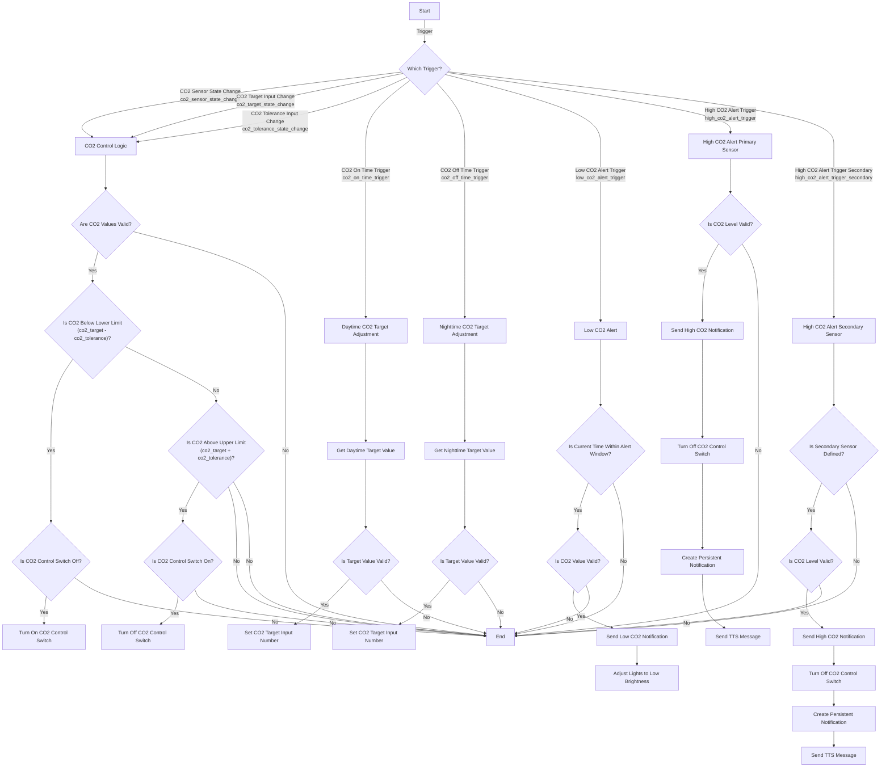

### **Explanation of the Diagram:**

- **Start:** The automation begins when any of the specified triggers occur.
  
- **Trigger Decision Point (B):** Determines which trigger activated the automation and directs the flow accordingly.

#### **CO₂ Target Adjustments:**

- **Daytime CO₂ Target Adjustment (D):**
  - Gets the daytime target value.
  - Checks if the value is valid.
  - Sets the CO₂ target input number if valid.

- **Nighttime CO₂ Target Adjustment (E):**
  - Similar to daytime adjustment but uses the nighttime target value.

#### **Low CO₂ Alert (F):**

- Checks if the current time is within the low CO₂ alert window.
- Validates the CO₂ sensor value.
- If valid, sends a low CO₂ notification and adjusts lights to the specified low brightness.

#### **High CO₂ Alert (Primary Sensor) (G):**

- Validates the CO₂ level from the primary sensor.
- If valid, performs the following actions:
  - Sends a high CO₂ notification with CO₂ levels.
  - Turns off the CO₂ control switch.
  - Creates a persistent notification.
  - Sends a TTS message.

#### **High CO₂ Alert (Secondary Sensor) (H):**

- Checks if the secondary sensor is defined.
- Validates the CO₂ level from the secondary sensor.
- If valid, performs similar actions as the primary sensor alert.

#### **CO₂ Control Logic (C):**

- Validates the CO₂ sensor values and input numbers.
- Checks if the CO₂ level is below the lower limit (target minus tolerance):
  - If yes, and the CO₂ control switch is off, turns on the switch.
- Checks if the CO₂ level is above the upper limit (target plus tolerance):
  - If yes, and the CO₂ control switch is on, turns off the switch.

### **Notes:**

- **Validation Steps:** At multiple points, the automation checks if values are valid (not `None`, `unknown`, or `unavailable`) before proceeding.
  
- **End Nodes (I):** The automation ends if any conditions are not met or after actions are executed.

- **Sequence Flow:** The diagram illustrates the flow of logic based on the triggers and conditions, helping to visualize how the automation processes each event.

### **How to Use the Diagram:**

- **Understanding Triggers:** Use the diagram to see what happens when each trigger occurs.

- **Following the Logic:** Trace the path from the trigger through conditions and actions to understand the automation's behavior.

- **Identifying Conditions:** The decision points (diamonds) show where the automation checks for specific conditions before proceeding.

- **Actions:** Rectangular nodes represent actions taken by the automation.

### **Additional Considerations:**

- **Customizing the Automation:**
  - You can adjust thresholds, durations, and targets to fit your needs.
  - Ensure that any changes maintain the logical flow depicted in the diagram.

- **Testing:**
  - Use the diagram as a reference when testing each part of the automation.
  - Confirm that triggers and actions occur as expected.
