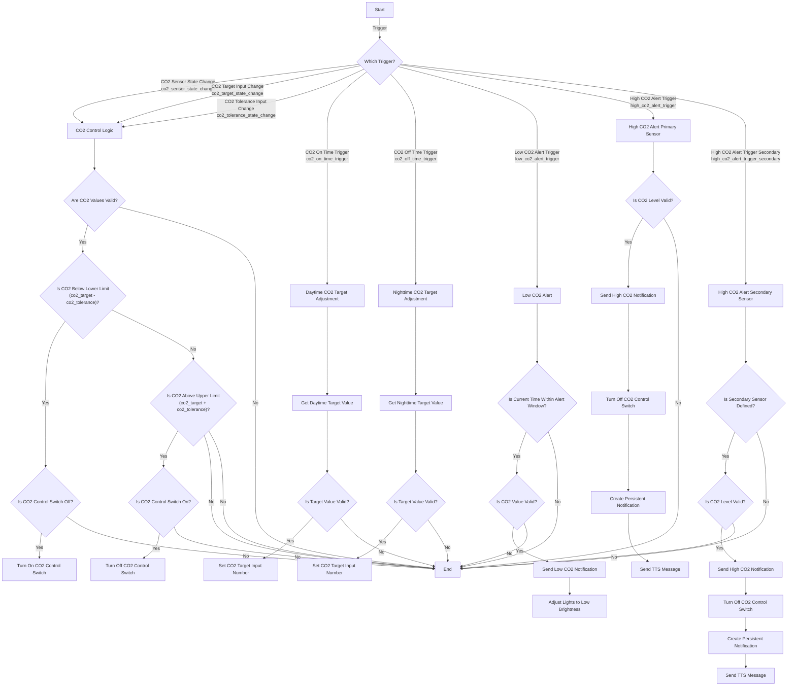

Blueprint import url: https://gist.github.com/JakeTheRabbit/41fbc01a62006cfef7172dc5b8534b60


### **Explanation of the Diagram:**

- **Start:** The automation begins when any of the specified triggers occur.
  
- **Trigger Decision Point (B):** Determines which trigger activated the automation and directs the flow accordingly.

#### **CO₂ Target Adjustments:**

- **Daytime CO₂ Target Adjustment (D):**
  - Gets the daytime target value.
  - Checks if the value is valid.
  - Sets the CO₂ target input number if valid.

- **Nighttime CO₂ Target Adjustment (E):**
  - Similar to daytime adjustment but uses the nighttime target value.

#### **Low CO₂ Alert (F):**

- Checks if the current time is within the low CO₂ alert window.
- Validates the CO₂ sensor value.
- If valid, sends a low CO₂ notification and adjusts lights to the specified low brightness.

#### **High CO₂ Alert (Primary Sensor) (G):**

- Validates the CO₂ level from the primary sensor.
- If valid, performs the following actions:
  - Sends a high CO₂ notification with CO₂ levels.
  - Turns off the CO₂ control switch.
  - Creates a persistent notification.
  - Sends a TTS message.

#### **High CO₂ Alert (Secondary Sensor) (H):**

- Checks if the secondary sensor is defined.
- Validates the CO₂ level from the secondary sensor.
- If valid, performs similar actions as the primary sensor alert.

#### **CO₂ Control Logic (C):**

- Validates the CO₂ sensor values and input numbers.
- Checks if the CO₂ level is below the lower limit (target minus tolerance):
  - If yes, and the CO₂ control switch is off, turns on the switch.
- Checks if the CO₂ level is above the upper limit (target plus tolerance):
  - If yes, and the CO₂ control switch is on, turns off the switch.

### **Notes:**

- **Validation Steps:** At multiple points, the automation checks if values are valid (not `None`, `unknown`, or `unavailable`) before proceeding.
  
- **End Nodes (I):** The automation ends if any conditions are not met or after actions are executed.

- **Sequence Flow:** The diagram illustrates the flow of logic based on the triggers and conditions, helping to visualize how the automation processes each event.

### **How to Use the Diagram:**

- **Understanding Triggers:** Use the diagram to see what happens when each trigger occurs.

- **Following the Logic:** Trace the path from the trigger through conditions and actions to understand the automation's behavior.

- **Identifying Conditions:** The decision points (diamonds) show where the automation checks for specific conditions before proceeding.

- **Actions:** Rectangular nodes represent actions taken by the automation.

### **Additional Considerations:**

- **Customizing the Automation:**
  - You can adjust thresholds, durations, and targets to fit your needs.
  - Ensure that any changes maintain the logical flow depicted in the diagram.

- **Testing:**
  - Use the diagram as a reference when testing each part of the automation.
  - Confirm that triggers and actions occur as expected.


Blueprint: 

```
blueprint:
  name: CO₂ Control and Alerts
  description: >
    Controls CO₂ levels by adjusting targets at specified times, manages switches based on CO₂ readings,
    sends low and high CO₂ alerts, and adjusts lights accordingly.

    **Helpers to Add:**
    Copy and paste the following into your `configuration.yaml` to create the necessary helpers.

    ```yaml
    input_number:
      co2_target_input:
        name: CO₂ Target Input
        min: 0
        max: 5000
        step: 1
        unit_of_measurement: 'ppm'
      co2_tolerance_input:
        name: CO₂ Tolerance Input
        min: 0
        max: 1000
        step: 1
        unit_of_measurement: 'ppm'
      co2_day_target_input:
        name: Daytime CO₂ Target Input
        min: 0
        max: 5000
        step: 1
        unit_of_measurement: 'ppm'
      co2_night_target_input:
        name: Nighttime CO₂ Target Input
        min: 0
        max: 5000
        step: 1
        unit_of_measurement: 'ppm'

    input_datetime:
      co2_on_time:
        name: CO₂ Target On Time
        has_time: true
        has_date: false
      co2_off_time:
        name: CO₂ Target Off Time
        has_time: true
        has_date: false
      low_co2_time_start:
        name: Low CO₂ Alert Start Time
        has_time: true
        has_date: false
      low_co2_time_end:
        name: Low CO₂ Alert End Time
        has_time: true
        has_date: false
    ```

    **Explanation:**

    This blueprint performs the following functions:

    1. **CO₂ Target Adjustment:**
       - Adjusts the CO₂ target at specified times using `input_datetime` helpers.
       - Daytime and nighttime targets are set using `input_number` helpers.

    2. **CO₂ Control Logic:**
       - Monitors a CO₂ sensor and controls a switch based on CO₂ levels, target, and tolerance.
       - The switch turns on when CO₂ is below the lower limit and off when above the upper limit.

    3. **Low CO₂ Alert:**
       - Sends notifications and dims specified lights when CO₂ levels are below a threshold during a specified time window.

    4. **High CO₂ Alert:**
       - Sends notifications, turns off a switch, and sends a TTS message when CO₂ levels exceed certain thresholds.
       - Supports monitoring a secondary CO₂ sensor for high CO₂ alerts.

    **Features:**

    - **Dynamic Scheduling:** Adjusts CO₂ targets based on user-defined times.
    - **Customizable Thresholds:** Set your own CO₂ targets, tolerances, and alert thresholds.
    - **Notifications:** Receive alerts via multiple notification services.
    - **Light Control:** Automatically dims lights when CO₂ is low.
    - **Text-To-Speech Alerts:** Get audible alerts when CO₂ levels are high.

    **Limitations and Gotchas:**

    - **Ensure Helpers Exist:** All `input_number` and `input_datetime` helpers must be created as specified.
    - **Time Format:** `input_datetime` helpers must have `has_time: true` and `has_date: false`.
    - **Notification Services:** Must select valid notification and TTS services using entity selectors.
    - **Entity IDs:** Verify that all entity IDs used in the automation exist in your Home Assistant setup.
    - **Automation Mode:** The automation is set to `mode: restart` to ensure timely execution but may interrupt ongoing actions.

    **Usage:**

    - **Import the Blueprint:** Follow the instructions below to add this blueprint to your Home Assistant.
    - **Create an Automation:** Use the blueprint to create an automation, filling in all required fields.
    - **Adjust Helpers:** Set your desired CO₂ targets, tolerances, and times using the helpers.
    - **Test the Automation:** Verify that all parts of the automation work as expected.

    **Important Considerations:**

    - **Testing:** It's recommended to test each feature individually before relying on the automation.
    - **Time Zones:** Ensure your Home Assistant time zone settings are correct to avoid scheduling issues.
    - **Service Compatibility:** Ensure that your selected notification and TTS services support the data parameters used.
    - **Entity Verification:** Double-check that all entity IDs selected during blueprint instantiation exist and are correctly configured in your Home Assistant setup.

  domain: automation
  input:
    co2_sensor:
      name: CO₂ Sensor
      description: The primary CO₂ sensor entity to monitor.
      selector:
        entity:
          domain: sensor
    co2_sensor_secondary:
      name: Secondary CO₂ Sensor (Optional)
      description: >
        A secondary CO₂ sensor entity to monitor for high CO₂ alerts. Leave blank if not used.
      default: ''
      selector:
        entity:
          domain: sensor
    co2_target_input:
      name: CO₂ Target Input Number
      description: The input_number entity for the current CO₂ target.
      selector:
        entity:
          domain: input_number
    co2_tolerance_input:
      name: CO₂ Tolerance Input Number
      description: The input_number entity for CO₂ tolerance.
      selector:
        entity:
          domain: input_number
    co2_day_target_input:
      name: Daytime CO₂ Target Input Number
      description: The input_number entity for the daytime CO₂ target.
      selector:
        entity:
          domain: input_number
    co2_night_target_input:
      name: Nighttime CO₂ Target Input Number
      description: The input_number entity for the nighttime CO₂ target.
      selector:
        entity:
          domain: input_number
    co2_on_time:
      name: CO₂ Target On Time
      description: The input_datetime entity for when to set the daytime CO₂ target.
      selector:
        entity:
          domain: input_datetime
    co2_off_time:
      name: CO₂ Target Off Time
      description: The input_datetime entity for when to set the nighttime CO₂ target.
      selector:
        entity:
          domain: input_datetime
    co2_control_switch:
      name: CO₂ Control Switch
      description: The switch to control based on CO₂ levels.
      selector:
        entity:
          domain: switch
    low_co2_threshold:
      name: Low CO₂ Threshold
      description: The CO₂ level below which to trigger a low CO₂ alert.
      default: 600
      selector:
        number:
          min: 0
          max: 2000
          unit_of_measurement: ppm
          mode: box
    low_co2_duration:
      name: Low CO₂ Duration (Minutes)
      description: Duration for CO₂ level to be below threshold before alerting.
      default: 1
      selector:
        number:
          min: 0
          max: 60
          unit_of_measurement: minutes
          mode: box
    low_co2_lights:
      name: Lights to Adjust on Low CO₂
      description: Lights to dim when CO₂ is low.
      selector:
        target:
          entity:
            domain: light
    low_co2_brightness_pct:
      name: Low CO₂ Brightness Percentage
      description: Brightness percentage to set the lights to when CO₂ is low.
      default: 60
      selector:
        number:
          min: 0
          max: 100
          unit_of_measurement: "%"
          mode: slider
    low_co2_time_start:
      name: Low CO₂ Alert Start Time
      description: Input_datetime for the start time of low CO₂ alert period.
      selector:
        entity:
          domain: input_datetime
    low_co2_time_end:
      name: Low CO₂ Alert End Time
      description: Input_datetime for the end time of low CO₂ alert period.
      selector:
        entity:
          domain: input_datetime
    high_co2_threshold:
      name: High CO₂ Threshold
      description: The CO₂ level above which to trigger a high CO₂ alert.
      default: 1800
      selector:
        number:
          min: 0
          max: 5000
          unit_of_measurement: ppm
          mode: box
    high_co2_duration:
      name: High CO₂ Duration (Seconds)
      description: Duration for CO₂ level to be above threshold before alerting.
      default: 11
      selector:
        number:
          min: 0
          max: 600
          unit_of_measurement: seconds
          mode: box
    high_co2_threshold_secondary:
      name: High CO₂ Threshold (Secondary Sensor)
      description: The CO₂ level above which to trigger a high CO₂ alert from the secondary sensor.
      default: 2500
      selector:
        number:
          min: 0
          max: 5000
          unit_of_measurement: ppm
          mode: box
    high_co2_duration_secondary:
      name: High CO₂ Duration (Secondary Sensor) (Seconds)
      description: Duration for CO₂ level to be above threshold before alerting (secondary sensor).
      default: 11
      selector:
        number:
          min: 0
          max: 600
          unit_of_measurement: seconds
          mode: box
    notification_service:
      name: Notification Service
      description: The notification services to send alerts to.
      selector:
        entity:
          domain: notify
          multiple: true
    tts_notification_service:
      name: TTS Notification Service
      description: The TTS service to send audible alerts.
      selector:
        entity:
          domain: tts
    notification_title_low:
      name: Low CO₂ Notification Title
      description: Title for low CO₂ notifications.
      default: "CO₂ LOW"
      selector:
        text:
    notification_message_low:
      name: Low CO₂ Notification Message
      description: Message for low CO₂ notifications.
      default: "CO₂ is low, lights have been dimmed to {{ low_co2_brightness_pct }}%"
      selector:
        text:
    notification_title_high:
      name: High CO₂ Notification Title
      description: Title for high CO₂ notifications.
      default: "High CO₂ Alert"
      selector:
        text:
    notification_message_high:
      name: High CO₂ Notification Message
      description: Message for high CO₂ notifications.
      default: "High CO₂ levels detected."
      selector:
        text:
    tts_message_high:
      name: High CO₂ TTS Message
      description: Message for Text-To-Speech when high CO₂ detected.
      default: "Attention: CO₂ levels are high."
      selector:
        text:

mode: restart
max_exceeded: silent
trigger:
  # CO₂ Sensor or Input Numbers Change (Control Logic)
  - platform: state
    entity_id: !input co2_sensor
    id: co2_sensor_state_change
  - platform: state
    entity_id: !input co2_target_input
    id: co2_target_state_change
  - platform: state
    entity_id: !input co2_tolerance_input
    id: co2_tolerance_state_change
  # Time Triggers for Target Adjustment
  - platform: time
    at: !input co2_on_time
    id: co2_on_time_trigger
  - platform: time
    at: !input co2_off_time
    id: co2_off_time_trigger
  # Low CO₂ Alert Trigger
  - platform: numeric_state
    entity_id: !input co2_sensor
    below: !input low_co2_threshold
    for:
      minutes: !input low_co2_duration
    id: low_co2_alert_trigger
  # High CO₂ Alert Trigger (Primary Sensor)
  - platform: numeric_state
    entity_id: !input co2_sensor
    above: !input high_co2_threshold
    for:
      seconds: !input high_co2_duration
    id: high_co2_alert_trigger
  # High CO₂ Alert Trigger (Secondary Sensor)
  - platform: numeric_state
    entity_id: !input co2_sensor_secondary
    above: !input high_co2_threshold_secondary
    for:
      seconds: !input high_co2_duration_secondary
    id: high_co2_alert_trigger_secondary
conditions: []
action:
  - choose:
      # Daytime CO₂ Target Adjustment
      - conditions:
          - condition: trigger
            id: co2_on_time_trigger
        sequence:
          - variables:
              target_value: "{{ states('!input co2_day_target_input') | float(0) }}"
          - condition: template
            value_template: "{{ target_value > 0 }}"
          - service: input_number.set_value
            target:
              entity_id: !input co2_target_input
            data:
              value: "{{ target_value }}"
      # Nighttime CO₂ Target Adjustment
      - conditions:
          - condition: trigger
            id: co2_off_time_trigger
        sequence:
          - variables:
              target_value: "{{ states('!input co2_night_target_input') | float(0) }}"
          - condition: template
            value_template: "{{ target_value > 0 }}"
          - service: input_number.set_value
            target:
              entity_id: !input co2_target_input
            data:
              value: "{{ target_value }}"
      # Low CO₂ Alert
      - conditions:
          - condition: trigger
            id: low_co2_alert_trigger
          - condition: template
            value_template: >
              
              
              
              {% set time_start = strptime(time_start_str, '%H:%M') %}
              {% set time_end = strptime(time_end_str, '%H:%M') %}
              
              
              {{ start_time <= time_now <= end_time }}
          - condition: template
            value_template: "{{ states('!input co2_sensor') | float(0) < low_co2_threshold }}"
        sequence:
          - repeat:
              for_each: "{{ notification_service }}"
              sequence:
                - service: "{{ repeat.item }}"
                  data:
                    title: "{{ notification_title_low }}"
                    message: "{{ notification_message_low }}"
          - service: light.turn_on
            target: !input low_co2_lights
            data:
              brightness_pct: "{{ low_co2_brightness_pct }}"
      # High CO₂ Alert (Primary Sensor)
      - conditions:
          - condition: trigger
            id: high_co2_alert_trigger
        sequence:
          - variables:
              co2_level: "{{ states('!input co2_sensor') | float(0) }}"
              co2_sensor_name: "{{ state_attr('!input co2_sensor', 'friendly_name') or '!input co2_sensor' }}"
          - condition: template
            value_template: "{{ co2_level > high_co2_threshold }}"
          - repeat:
              for_each: "{{ notification_service }}"
              sequence:
                - service: "{{ repeat.item }}"
                  data:
                    title: "{{ notification_title_high }}"
                    message: >
                      {{ co2_sensor_name }} CO₂ level: {{ co2_level }} ppm.
          - service: switch.turn_off
            target:
              entity_id: !input co2_control_switch
          - service: persistent_notification.create
            data:
              title: "{{ notification_title_high }}"
              message: "{{ co2_sensor_name }} CO₂ level: {{ co2_level }} ppm."
          - service: !input tts_notification_service
            data:
              message: "{{ tts_message_high }}"
      # High CO₂ Alert (Secondary Sensor)
      - conditions:
          - condition: trigger
            id: high_co2_alert_trigger_secondary
          - condition: template
            value_template: "{{ co2_sensor_secondary != '' }}"
        sequence:
          - variables:
              co2_level_secondary: "{{ states('!input co2_sensor_secondary') | float(0) }}"
              co2_sensor_secondary_name: "{{ state_attr('!input co2_sensor_secondary', 'friendly_name') or '!input co2_sensor_secondary' }}"
          - condition: template
            value_template: "{{ co2_level_secondary > high_co2_threshold_secondary }}"
          - repeat:
              for_each: "{{ notification_service }}"
              sequence:
                - service: "{{ repeat.item }}"
                  data:
                    title: "{{ notification_title_high }}"
                    message: >
                      {{ co2_sensor_secondary_name }} CO₂ level: {{ co2_level_secondary }} ppm.
          - service: switch.turn_off
            target:
              entity_id: !input co2_control_switch
          - service: persistent_notification.create
            data:
              title: "{{ notification_title_high }}"
              message: "{{ co2_sensor_secondary_name }} CO₂ level: {{ co2_level_secondary }} ppm."
          - service: !input tts_notification_service
            data:
              message: "{{ tts_message_high }}"
    default:
      # CO₂ Control Logic
      - variables:
          co2_value: "{{ states('!input co2_sensor') | float(0) }}"
          co2_target: "{{ states('!input co2_target_input') | float(0) }}"
          co2_tolerance: "{{ states('!input co2_tolerance_input') | float(0) }}"
      - condition: template
        value_template: >
          {{ co2_value > 0 and co2_target > 0 and co2_tolerance > 0 }}
      - variables:
          co2_lower_limit: "{{ co2_target - co2_tolerance }}"
          co2_upper_limit: "{{ co2_target + co2_tolerance }}"
      - choose:
          - conditions:
              - condition: template
                value_template: "{{ co2_value < co2_lower_limit }}"
              - condition: state
                entity_id: !input co2_control_switch
                state: 'off'
            sequence:
              - service: switch.turn_on
                target:
                  entity_id: !input co2_control_switch
          - conditions:
              - condition: template
                value_template: "{{ co2_value > co2_upper_limit }}"
              - condition: state
                entity_id: !input co2_control_switch
                state: 'on'
            sequence:
              - service: switch.turn_off
                target:
                  entity_id: !input co2_control_switch
```
