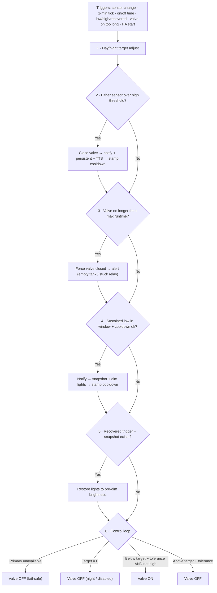

# CO₂ Control and Alerts — import notes

Import notes and logic overview for the CO₂ blueprint. The blueprint itself is the
single source of truth:

**[`../blueprints/co2_control_and_alerts.yaml`](../blueprints/co2_control_and_alerts.yaml)**

> This file used to embed a full copy of the blueprint YAML. That copy drifted out
> of date, so it has been removed — always import the blueprint file above rather
> than any snippet pasted here. Requires **Home Assistant 2024.10+**.

## Import

1. **Settings → Automations & Scenes → Blueprints → Import Blueprint**.
2. Paste the raw URL of [`blueprints/co2_control_and_alerts.yaml`](https://github.com/JakeTheRabbit/HAGR/blob/main/blueprints/co2_control_and_alerts.yaml) and import.
3. **Create automation** from it and fill in the inputs.

For local development you can instead drop the file into
`<config>/blueprints/automation/<your-namespace>/` and reload.

## Helpers to create first

Create these under **Settings → Devices & Services → Helpers** (or in YAML) before
creating the automation:

```yaml
input_number:
  co2_target_input:      { name: CO₂ Target Input,          min: 0, max: 5000, step: 1, unit_of_measurement: ppm, mode: box }
  co2_tolerance_input:   { name: CO₂ Tolerance Input,       min: 0, max: 1000, step: 1, unit_of_measurement: ppm, mode: box }
  co2_day_target_input:  { name: Daytime CO₂ Target Input,  min: 0, max: 5000, step: 1, unit_of_measurement: ppm, mode: box }
  co2_night_target_input:{ name: Nighttime CO₂ Target Input,min: 0, max: 5000, step: 1, unit_of_measurement: ppm, mode: box }

input_datetime:
  co2_on_time:          { name: CO₂ Target On Time,        has_time: true, has_date: false }
  co2_off_time:         { name: CO₂ Target Off Time,       has_time: true, has_date: false }
  low_co2_time_start:   { name: Low CO₂ Alert Start Time,  has_time: true, has_date: false }
  low_co2_time_end:     { name: Low CO₂ Alert End Time,    has_time: true, has_date: false }
  last_low_co2_alert:   { name: Last Low CO₂ Alert Time,   has_time: true, has_date: true }
  last_high_co2_alert:  { name: Last High CO₂ Alert Time,  has_time: true, has_date: true }
```

The two `last_*_alert` datetimes back the alert cooldowns and must have both
`has_time` and `has_date` set to `true`.

## What it does

The automation is one loop that runs on sensor changes, a 1-minute tick, the day/night
schedule, and the safety triggers. Each run walks these independent steps:

1. **Day/night target** — sets `co2_target_input` to the day or night value based on the
   on/off times (handles windows that cross midnight; leaves the target unchanged if the
   times are unavailable).
2. **High-CO₂ safety** — if the primary sensor, or the optional backup sensor, is over its
   threshold: close the CO₂ valve, notify (push + persistent + optional TTS), and stamp the
   high-alert cooldown. The backup sensor is polled, so leaving it blank is safe.
3. **Relay-stuck / empty-tank safety** — if the valve has been on longer than the max
   runtime, force it closed and alert.
4. **Low-CO₂ alert** — if the sensor is sustained-low inside the alert window and the
   cooldown has elapsed: notify and (optionally) snapshot + dim the lights.
5. **Low-CO₂ recovery** — when CO₂ climbs back, restore the lights to their pre-dim state.
6. **Control loop** — hysteresis switching (`target ± tolerance`) with fail-safes: it will
   not open the valve while either sensor reads high, closes the valve if the primary sensor
   is unavailable, and treats a target of 0 (e.g. CO₂ off at night) as "hold closed".


```mermaid
graph TD
    Triggers["Triggers: sensor change · 1-min tick · on/off time · low/high/recovered · valve-on too long · HA start"] --> Step1

    Step1["1 · Day/night target adjust"] --> Step2
    Step2{"2 · Either sensor over high threshold?"}
    Step2 -->|Yes| HighAct["Close valve → notify + persistent + TTS → stamp cooldown"] --> Step3
    Step2 -->|No| Step3

    Step3{"3 · Valve on longer than max runtime?"}
    Step3 -->|Yes| Stuck["Force valve closed → alert (empty tank / stuck relay)"] --> Step4
    Step3 -->|No| Step4

    Step4{"4 · Sustained low in window + cooldown ok?"}
    Step4 -->|Yes| LowAct["Notify → snapshot + dim lights → stamp cooldown"] --> Step5
    Step4 -->|No| Step5

    Step5{"5 · Recovered trigger + snapshot exists?"}
    Step5 -->|Yes| Restore["Restore lights to pre-dim brightness"] --> Step6
    Step5 -->|No| Step6

    Step6{"6 · Control loop"}
    Step6 -->|Primary unavailable| Off1["Valve OFF (fail-safe)"]
    Step6 -->|Target = 0| Off2["Valve OFF (night / disabled)"]
    Step6 -->|"Below target − tolerance AND not high"| On["Valve ON"]
    Step6 -->|Above target + tolerance| Off3["Valve OFF"]
```

## Notes

- **Interface changed in the 2024.10 rewrite.** If you imported an earlier version,
  re-import: `high_co2_duration_secondary` and `tts_service_name` were removed;
  `max_co2_on_minutes` and a `tts_engine` entity were added; the lights input is now an
  entity list (was a target); TTS uses `tts.speak` and notifications use
  `notify.send_message`.
- Enable **TTS** only after picking a `tts_engine` and media player, or leave it off.
- See [`../blueprints/README.md`](../blueprints/README.md) for the full blueprint set and the
  helpers each one needs.
