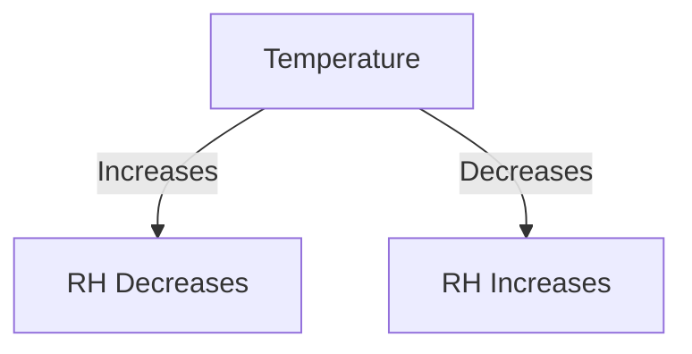
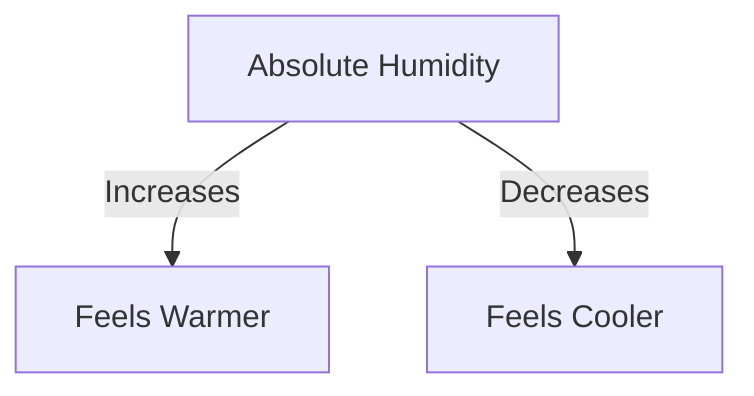
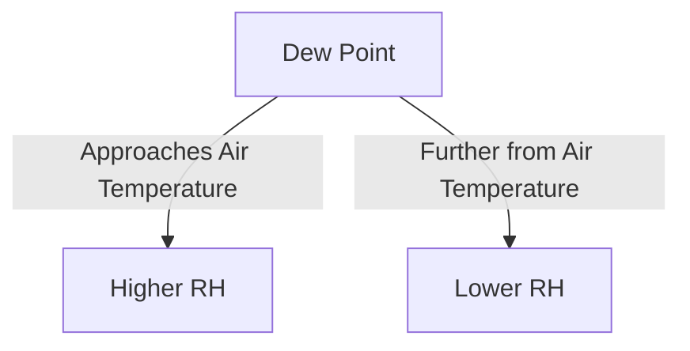
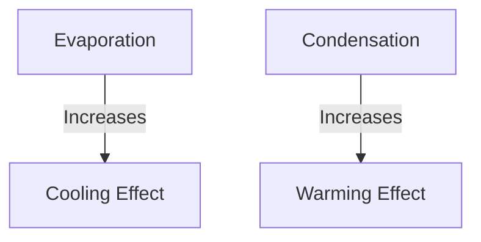
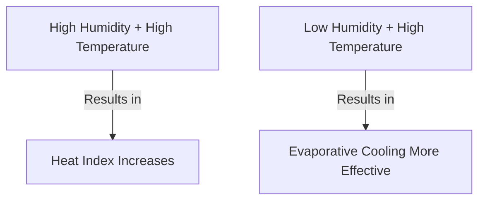
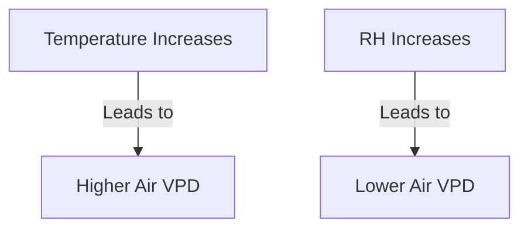
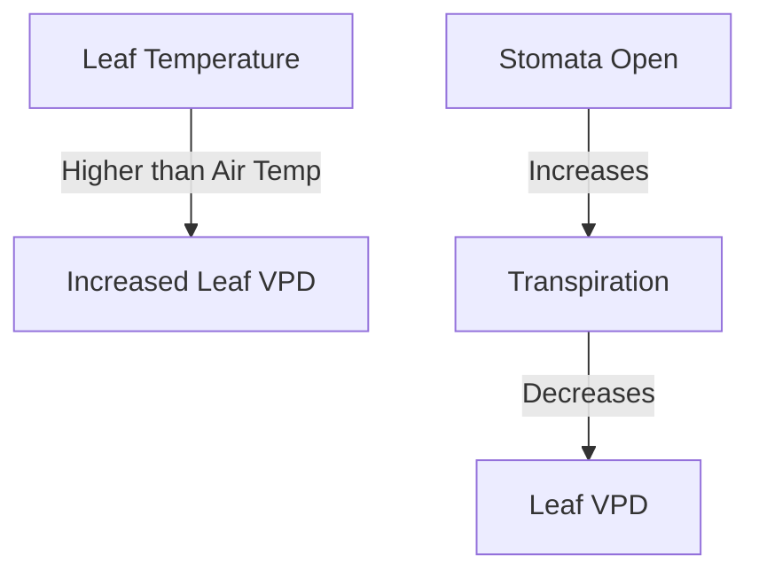
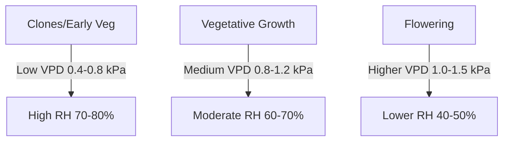

# Humidity and Temperature Cheat Sheet for Indoor Cannabis Cultivation

## Relative Humidity (RH)
The amount of water vapor in the air compared to the maximum amount it can hold at a given temperature, expressed as a percentage.

**Relevance:** In your grow room, RH directly affects transpiration rate. High RH in veg promotes growth, while low RH in flower prevents mold.

**Example:** A hot summer day might drop your grow room's RH to 30%, potentially stressing plants. Conversely, a cold night could spike RH to 70%, risking mold in flowering plants.

**Ideal Range:** 
- Clones/Seedlings: 70-80%
- Vegetative: 50-70%
- Early Flowering: 40-50%
- Late Flowering: 30-40%

## Absolute Humidity
The actual amount of water vapor in a given volume of air, regardless of temperature.

**Relevance:** Affects how quickly water evaporates from leaves and growing medium. High absolute humidity can lead to slow drying and increased risk of mold.

**Example:** On a muggy day, even with ideal temperature, your plants might struggle to transpire effectively due to high absolute humidity.

## Dew Point
The temperature at which water vapor in the air begins to condense into liquid water.

**Relevance:** Critical for preventing condensation on leaves and buds, which can lead to mold and mildew.

**Example:** If your grow room is 25°C with 60% RH, the dew point is about 16°C. If any part of a plant (like dense buds) drops below 16°C, condensation will form.

## Evaporation and Condensation
Evaporation: The process of liquid water turning into water vapor. 
Condensation: The process of water vapor turning into liquid water.

**Relevance:** Evaporation from leaves cools plants and humidifies air. Condensation on cold surfaces (like AC ducts) can drip onto plants, causing issues.

**Example:** Rapid evaporation in low humidity can cause nutrient burn as salts concentrate in the growing medium. Conversely, condensation on cold walls during lights-off can drip onto plants, potentially causing mold.

## Heat Index
How hot it feels when relative humidity is combined with the actual air temperature.

**Relevance:** High heat index can stress plants and reduce photosynthesis efficiency. Low humidity allows for more effective cooling through transpiration.

**Example:** A grow room at 28°C and 70% RH feels like 32°C to your plants, potentially causing heat stress.

## Vapor Pressure Deficit (VPD)
The difference between the amount of moisture in the air and how much moisture the air can hold when saturated.

### Air VPD

**Relevance:** VPD drives transpiration. Too low, and plants struggle to uptake nutrients. Too high, and plants lose water faster than they can absorb it.

**Example:** In veg, a VPD of 0.8 kPa (e.g., 25°C and 70% RH) promotes strong growth. In late flower, a higher VPD of 1.2 kPa (e.g., 26°C and 50% RH) helps prevent mold while maintaining growth.

**Ideal Range:** 0.8-1.2 kPa, adjusted throughout growth cycle

### Leaf VPD

**Relevance:** Leaf VPD more accurately represents what the plant experiences. It's affected by factors like light intensity and air movement.

**Example:** Under intense lights, leaf temperature might be 2-3°C above air temperature, increasing the actual VPD the plant experiences.

**Ideal Range:** Similar to Air VPD, but often slightly higher due to leaf temperature differences

## VPD and Plant Growth Stages

**Relevance:** VPD requirements change as plants mature. Young plants prefer lower VPD (higher humidity), while flowering plants benefit from higher VPD (lower humidity) to prevent mold and promote resin production.

**Example:** Clones might thrive at 24°C and 75% RH (VPD ~0.6 kPa), while the same plants in late flower might prefer 26°C and 45% RH (VPD ~1.4 kPa).

# Cannabis Grow Environment Matrix

| Growth Stage | Temperature (°C) | Relative Humidity (%) | VPD (kPa) | Notes |
|--------------|------------------|----------------------|-----------|-------|
| **Clones / Seedlings** | 20-25 | 70-80 | 0.4-0.8 | High humidity promotes root development. Use domes or misters. |
| **Early Vegetative** | 22-28 | 60-70 | 0.8-1.0 | Gradually decrease humidity. Increase air circulation. |
| **Late Vegetative** | 22-28 | 50-60 | 1.0-1.2 | Prepare plants for flowering conditions. |
| **Early Flowering** | 20-26 | 40-50 | 1.0-1.3 | Lower humidity to prevent mold. Increase light intensity. |
| **Late Flowering** | 18-24 | 30-40 | 1.2-1.5 | Further reduce humidity. Watch for bud rot in dense colas. |

## Environmental Factors Impact

| Factor | Low | High | Optimal Range | Impact on Plants |
|--------|-----|------|---------------|------------------|
| **Temperature** | < 18°C | > 30°C | 20-28°C | Affects metabolic rates, nutrient uptake, and overall growth speed. |
| **Relative Humidity** | < 30% | > 70% | Stage-dependent | Influences transpiration, nutrient uptake, and susceptibility to mold. |
| **VPD** | < 0.4 kPa | > 1.5 kPa | 0.8-1.2 kPa | Drives transpiration. Too low: slow growth. Too high: water stress. |
| **CO₂ Levels** | < 350 ppm | > 1500 ppm | 800-1200 ppm | Enhances photosynthesis rate and overall plant growth. |
| **Light Intensity** | Varies by stage | Varies by stage | 400-750 μmol/m²/s (veg) 600-1000 μmol/m²/s (flower) | Drives photosynthesis. Too low: stretching. Too high: light stress. |

## Troubleshooting Common Issues

| Symptom | Possible Cause | Solution |
|---------|----------------|----------|
| Leaf Curling Up | Heat stress, Low humidity | Lower temperature, increase humidity, improve air circulation |
| Powdery Mildew | High humidity, Poor air circulation | Reduce humidity, increase air movement, consider fungicides |
| Nutrient Burn | Over-fertilization, Low humidity | Flush medium, adjust nutrient levels, slightly increase humidity |
| Slow Growth | Low temperature, High humidity | Increase temperature, decrease humidity, check for root issues |
| Bud Rot | High humidity in flowering, Poor air circulation | Drastically reduce humidity, improve air circulation, remove affected buds |

## VPD Quick Reference

| Temperature (°C) | 40% RH | 50% RH | 60% RH | 70% RH |
|------------------|--------|--------|--------|--------|
| 20 | 1.4 kPa | 1.2 kPa | 0.9 kPa | 0.7 kPa |
| 22 | 1.6 kPa | 1.3 kPa | 1.1 kPa | 0.8 kPa |
| 24 | 1.8 kPa | 1.5 kPa | 1.2 kPa | 0.9 kPa |
| 26 | 2.0 kPa | 1.6 kPa | 1.3 kPa | 1.0 kPa |
| 28 | 2.2 kPa | 1.8 kPa | 1.5 kPa | 1.1 kPa |

