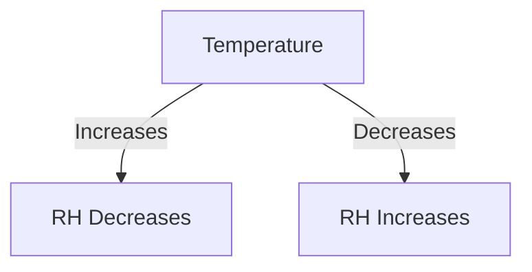
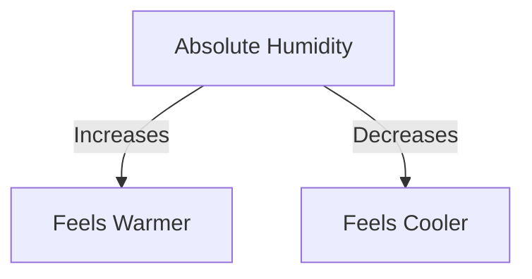
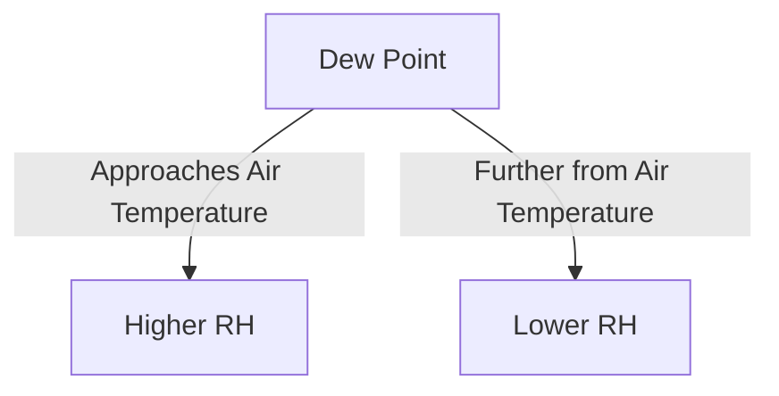
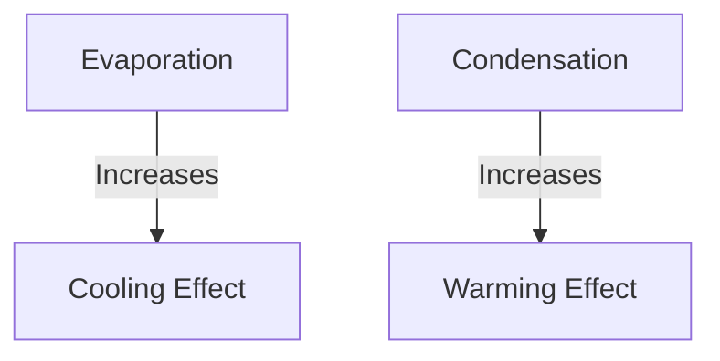
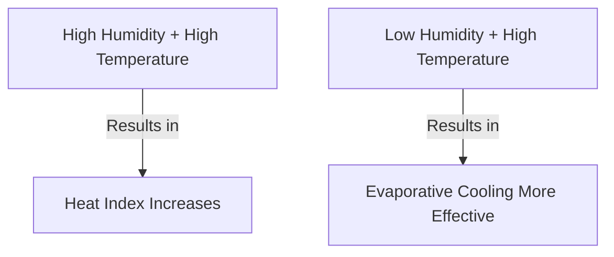
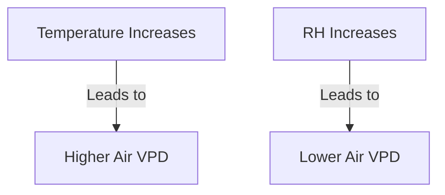
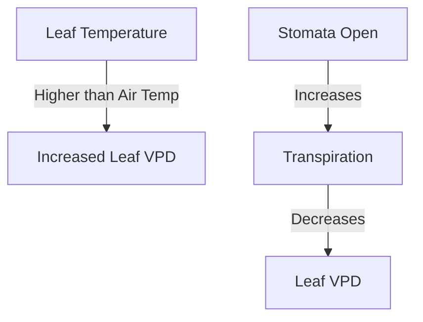
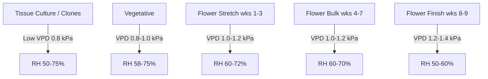

# Humidity and Temperature Cheat Sheet for Indoor Cannabis Cultivation

> **Environmental targets in this guide follow the [Athena Handbook](https://jaketherabbit.github.io/cannabis-grow-room-levers/) setpoints.**

## Relative Humidity (RH)
The amount of water vapor in the air compared to the maximum amount it can hold at a given temperature, expressed as a percentage.

```mermaid
graph TD
    A[Temperature] -->|Increases| B[RH Decreases]
    A -->|Decreases| C[RH Increases]
```

**Relevance:** In your grow room, RH directly affects transpiration rate. Athena keeps RH higher throughout the cycle than traditional guides — including into flowering — to support strong transpiration and canopy development.

**Athena Ideal Range:**
- Tissue Culture: 50–60%
- Clones: 65–75% room (dome: 80–95%)
- Vegetative: 58–75%
- Flower — Stretch (wks 1–3): 60–72%
- Flower — Bulk (wks 4–7): 60–70%
- Flower — Finish (wks 8–9): 50–60%
- Dry & Cure: 55–60%

## Absolute Humidity
The actual amount of water vapor in a given volume of air, regardless of temperature.

```mermaid
graph TD
    F[Absolute Humidity] -->|Increases| G[Feels Warmer]
    F -->|Decreases| H[Feels Cooler]
```

**Relevance:** Affects how quickly water evaporates from leaves and growing medium. High absolute humidity can lead to slow drying and increased risk of mold.

**Example:** On a muggy day, even with ideal temperature, your plants might struggle to transpire effectively due to high absolute humidity.

## Dew Point
The temperature at which water vapor in the air begins to condense into liquid water.

```mermaid
graph TD
    I[Dew Point] -->|Approaches Air Temperature| J[Higher RH]
    I -->|Further from Air Temperature| K[Lower RH]
```

**Relevance:** Critical for preventing condensation on leaves and buds, which can lead to mold and mildew.

**Example:** If your grow room is 25°C with 65% RH, the dew point is about 18°C. If any part of a plant (like dense buds) drops below 18°C, condensation will form.

## Evaporation and Condensation
Evaporation: The process of liquid water turning into water vapor.
Condensation: The process of water vapor turning into liquid water.

```mermaid
graph TD
    L[Evaporation] -->|Increases| M[Cooling Effect]
    N[Condensation] -->|Increases| O[Warming Effect]
```

**Relevance:** Evaporation from leaves cools plants and humidifies air. Condensation on cold surfaces (like AC ducts) can drip onto plants, causing issues.

**Example:** Rapid evaporation in low humidity can cause nutrient burn as salts concentrate in the growing medium. Conversely, condensation on cold walls during lights-off can drip onto plants, potentially causing mold.

## Heat Index
How hot it feels when relative humidity is combined with the actual air temperature.

```mermaid
graph TD
    P[High Humidity + High Temperature] -->|Results in| Q[Heat Index Increases]
    R[Low Humidity + High Temperature] -->|Results in| S[Evaporative Cooling More Effective]
```

**Relevance:** High heat index can stress plants and reduce photosynthesis efficiency.

**Example:** A grow room at 28°C and 72% RH feels like 34°C to your plants, potentially causing heat stress. Athena's flower stretch targets (25–28°C, 60–72% RH) are designed to stay just below this threshold with good air movement.

## Vapor Pressure Deficit (VPD)
The difference between the amount of moisture in the air and how much moisture the air can hold when saturated.

### Air VPD

```mermaid
graph TD
    T[Temperature Increases] -->|Leads to| U[Higher Air VPD]
    V[RH Increases] -->|Leads to| W[Lower Air VPD]
```

**Relevance:** VPD drives transpiration. Too low, and plants struggle to uptake nutrients. Too high, and plants lose water faster than they can absorb it.

**Athena Ideal Range by Stage:**
- Tissue Culture: 0.8–1.0 kPa
- Clones: ~0.8 kPa
- Vegetative: 0.8–1.0 kPa
- Flower — Stretch (wks 1–3): 1.0–1.2 kPa
- Flower — Bulk (wks 4–7): 1.0–1.2 kPa
- Flower — Finish (wks 8–9): 1.2–1.4 kPa

### Leaf VPD

```mermaid
graph TD
    X[Leaf Temperature] -->|Higher than Air Temp| Y[Increased Leaf VPD]
    Z[Stomata Open] -->|Increases| AA[Transpiration]
    AA -->|Decreases| AB[Leaf VPD]
```

**Relevance:** Leaf VPD more accurately represents what the plant experiences. It's affected by factors like light intensity and air movement.

**Example:** Under intense lights, leaf temperature might be 2–3°C above air temperature, increasing the actual VPD the plant experiences.

## VPD and Plant Growth Stages (Athena)

```mermaid
graph TD
    AC[Tissue Culture / Clones] -->|Low VPD 0.8 kPa| AD[RH 50-75%]
    AE[Vegetative] -->|VPD 0.8-1.0 kPa| AF[RH 58-75%]
    AG[Flower Stretch wks 1-3] -->|VPD 1.0-1.2 kPa| AH[RH 60-72%]
    AI[Flower Bulk wks 4-7] -->|VPD 1.0-1.2 kPa| AJ[RH 60-70%]
    AK[Flower Finish wks 8-9] -->|VPD 1.2-1.4 kPa| AL[RH 50-60%]
```

**Relevance:** Athena maintains higher RH through much of flowering compared to traditional guides. The VPD rise in late flower is achieved primarily through temperature reduction, not humidity reduction, which limits botrytis risk while still finishing the plant.

---

# Cannabis Grow Environment Matrix — Athena Handbook

| Growth Stage | Temp (°C) | RH (%) | VPD (kPa) | PPFD (µmol/m²/s) | CO₂ (ppm) | Feed EC (mS/cm) | Feed pH | Photoperiod |
|---|---|---|---|---|---|---|---|---|
| **Tissue Culture** | 20–23 | 50–60 | 0.8–1.0 | 75–125 | ambient | — | — | 18/6 |
| **Clones** | 23–26 | 65–75 (dome 80–95) | ~0.8 | 100–150 | ambient | 2.0–3.0 | 5.6–6.0 | 24/0 |
| **Vegetative** | 22–28 | 58–75 | 0.8–1.0 | 300–600 | ambient | 3.0 | 5.6–6.0 | 18/6 |
| **Flower — Stretch** (wks 1–3) | 25–28 | 60–72 | 1.0–1.2 | 600–1000 | 1200–1500 | 3.0 | 5.8–6.2 | 12/12 |
| **Flower — Bulk** (wks 4–7) | 24–26 | 60–70 | 1.0–1.2 | 850–1200 | 1200–1500 | 3.0 | 6.0–6.2 | 12/12 |
| **Flower — Finish** (wks 8–9) | 18–24 | 50–60 | 1.2–1.4 | 600–900 | 500–800 | 2.0–3.0 | 6.0–6.2 | 12/12 |
| **Dry & Cure** (14 days) | 15–18 | 55–60 | — | — | — | — | — | 0/24 |

> EC and pH are input feed targets. During clone propagation, dome RH runs 80–95% while room-level RH stays lower (65–75%).

---

## Environmental Factors Impact

| Factor | Too Low | Too High | Athena Target | Impact on Plants |
|--------|---------|----------|---------------|------------------|
| **Temperature** | < 18°C | > 30°C | Stage-dependent (see matrix) | Affects metabolic rates, nutrient uptake, and overall growth speed. |
| **Relative Humidity** | < 50% (veg) | > 75% (veg) | Stage-dependent (see matrix) | Influences transpiration, nutrient uptake, and susceptibility to mold. |
| **VPD** | < 0.8 kPa | > 1.4 kPa | 0.8–1.4 kPa stage-stepped | Drives transpiration. Too low: slow growth/nutrient lockout. Too high: water stress. |
| **CO₂ Levels** | < 400 ppm | > 1500 ppm | 1200–1500 ppm (flower) | Enhances photosynthesis rate and overall plant growth when paired with adequate PPFD. |
| **PPFD** | < 100 µmol (clones) | > 1200 µmol | Stage-dependent (see matrix) | Drives photosynthesis. Too low: stretch. Too high: photoinhibition/bleaching. |
| **Feed EC** | < 2.0 mS/cm | > 4.0 mS/cm | 3.0 mS/cm (peak) | Salt load determines nutrient availability; excess causes lockout. |
| **Feed pH** | < 5.5 | > 6.5 | 5.6–6.2 stage-stepped | Controls nutrient availability at the root zone. |

---

## Troubleshooting Common Issues

| Symptom | Possible Cause | Solution |
|---------|----------------|----------|
| Leaf Curling Up | Heat stress, VPD too high | Lower temperature, raise RH to bring VPD into range, improve air circulation |
| Powdery Mildew | Stagnant air, RH spikes (not high RH per se) | Improve air movement and circulation, avoid dead spots — Athena does not require low RH to avoid PM |
| Nutrient Burn | Over-fertilization, VPD too high concentrating salts | Flush medium, lower EC, check VPD |
| Slow Growth / Drooping | VPD too low, waterlogged root zone | Slightly lower RH or raise temp to increase VPD, check dryback |
| Bud Rot (Botrytis) | Dense canopy + poor airflow + cool spots | Improve canopy airflow, prevent cold spots on buds — not solved by blanketing humidity reduction |
| Stretchy Internodes | Low PPFD or CO₂ | Increase light intensity (target 600+ µmol in stretch), raise CO₂ to 1200–1500 ppm |

---

## VPD Quick Reference

| Temp (°C) | 50% RH | 60% RH | 65% RH | 70% RH | 75% RH |
|-----------|--------|--------|--------|--------|--------|
| 20 | 1.17 kPa | 0.94 kPa | 0.82 kPa | 0.70 kPa | 0.59 kPa |
| 22 | 1.32 kPa | 1.06 kPa | 0.92 kPa | 0.79 kPa | 0.66 kPa |
| 24 | 1.49 kPa | 1.19 kPa | 1.04 kPa | 0.89 kPa | 0.74 kPa |
| 26 | 1.67 kPa | 1.34 kPa | 1.17 kPa | 1.00 kPa | 0.84 kPa |
| 28 | 1.87 kPa | 1.50 kPa | 1.31 kPa | 1.12 kPa | 0.94 kPa |

> **Athena flower targets highlighted:** Stretch/Bulk sits in the 1.0–1.2 kPa band (e.g. 26°C / 65–70% RH). Finish moves to 1.2–1.4 kPa via temperature drop, not humidity reduction.

---

*Sources: [Athena Handbook via cannabis-grow-room-levers](https://jaketherabbit.github.io/cannabis-grow-room-levers/)*
